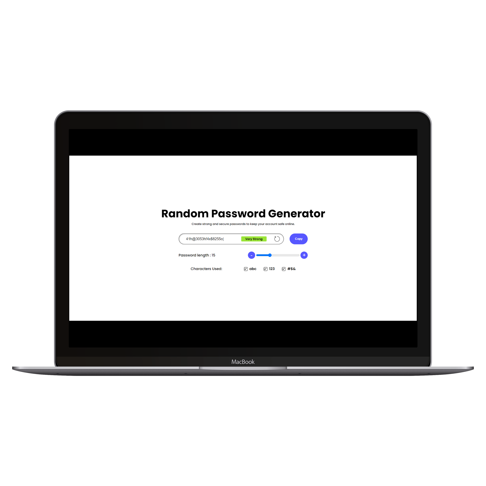
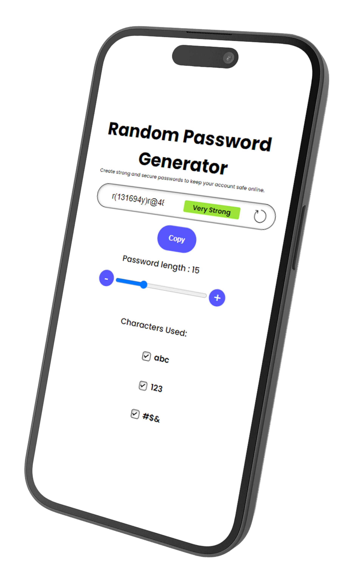

# RandomVault-v2

## Description

- This web application generates random passwords based on user-selected criteria, including length and character types.

## Features

- Select password length using a slider.
- Include or exclude:
  - Lowercase letters
  - Numbers
  - Symbols
- Displays password strength based on length.

## Preview

